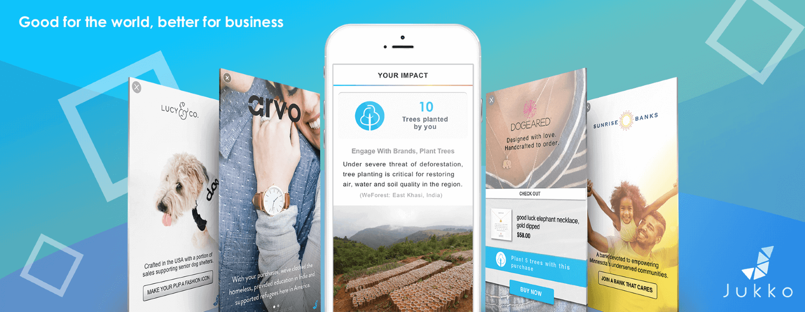

# Jukko Android SDK documentation



Welcome to the Jukko developer SDK documentation for Android. Follow our step-by-step instructions to
integrate Jukko and start monetizing while converting your app into a catalyst for social
impact today!

If you have any questions during the integration process, you can reach us at [devs@jukko.com](mailto:devs@jukko.com)
and we'll get back to you ASAP. Thanks for joining our movement to create a better world and
a better way of doing business.

## Integration

1. Add the following lines to your root project's `build.gradle` file:

```gradle
allprojects {
    repositories {
        ....
        maven { url "https://sdk.jukko.com/android" }
    }
}
```

2. In your application's `build.gradle` add the following line to the dependencies list:

```gradle
dependencies {
    implementation 'com.jukko.sdk:jukko-sdk:1.0.6'
}
```

## Usage

### Initialization

Initialization has to be done before the Jukko SDK can be customized and launched. The method will
need an API key and context object. The API key can be generated in the dashboard after registration.
You can register on [Jukko dashboard]( https://dashboard.jukko.com) any time.

```java
import com.jukko.sdk.JukkoSdk;

JukkoSdk.getInstance().init(context, "API_KEY");
```

### Showing an ad

You can show an ad by calling `showAd()` method of the Jukko SDK:

```java
import com.jukko.sdk.JukkoSdk;
import com.jukko.sdk.JukkoSdkInterface;

JukkoSdk.getInstance().showAd(new JukkoSdkInterface.AdCallback() {
    @Override
    public void onClosed(JukkoSdkInterface.ShowAdResult event) {
        //handle onClosed events here
    }
});
```

The ad will be shown in a separate activity. When ad activity is closed, `onClosed()` callback will be called on the main thread. It will contain an object with following information:

* `reason`: Reason why the ad was closed. Possible values are:
  * `CLOSED_BY_USER`: Ad activity was closed by user.
  * `TIMEOUT`: Ad activity was closed due to server not responding within timeout window.
  * `NETWORK_CONNECTIVITY`: Ad activity was closed due to network connectivity problems.
  * `FREQUENCY_CAPPING`: Ads frequency capping is enabled and time period didn't pass since the last `showAd()` call.
  * `ERROR`: Ad activity was closed due to unspecified error. Additional details will be provided in `message`.
* `message`: Contains additional information as to why activity was closed.
* `events`: List of events that happened on ad activity lifecycle. May be empty. Each event contains:
  * `timestamp` of the event in current device timezone.
  * `adEvent` type of event. Possible values:
    * `LAUNCH`: Ad activity was opened.
    * `CLOSE`: Ad activity was closed.
    * `AD_SHOWN`: Ad was shown to user.
    * `AD_URL_OPENED`: User clicked on ad link that was opened in external browser.

### Frequency capping

The Jukko SDK allows for frequency capping of ads. It counts time since the last time when an ad was closed
and ignores `showAd()` calls until frequency capping period ends. Frequency capping can be changed
using:

```java
JukkoSdk.getInstance().setAdsFrequency(timeInSeconds);
```

Set `0` to disable frequency capping.

### Console logging

By default, the Jukko SDK logs only important messages, such as unrecoverable errors.

You can enable debug logging to receive more logs with lifecycle details by calling:

```java
JukkoSdk.getInstance().setDebugMode(true);
```

Log messages will contain `Jukko SDK` tag.

## Google Play Services

If the user has Google Play services on their devices, the SDK will automatically use user's
Advertising ID (GAID) and Limit Ad Tracking setting.

For more information about Google Advertising ID visit [this link](https://play.google.com/about/monetization-ads/ads/ad-id/).

## Requirements

The Jukko SDK supports devices starting with Android 4.0 (API level 14). However, due to some older WebView version restrictions, ad UI won't be shown for Android prior to 4.4 (API level < 19) and SDK will only log some messages in console specifying this.

Due to WebView limitations, your application should also have `compileSdkVersion` set to `25` or higher.
